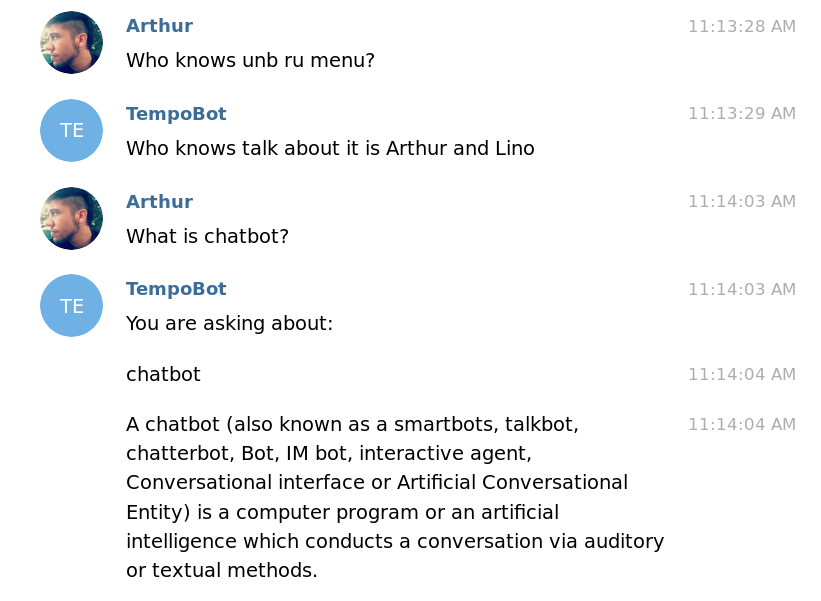

# Report

This report its about the creation of an ontology about chatbots.

You can find the source of this project in my repository:

[github,com/arthurTemporim/semantic_web_playground](https://github.com/arthurTemporim/semantic_web_playground/blob/master/project/)

## Context

Since 2015 with the publish of the [Facebook API](https://developers.facebook.com/docs/messenger-platform/) enabling the usage of chatbots with users through facebook, many developers start to use this technology to many differents contexts.

The objective of this project is to describe the concept of **chatbot** and be able to fit any kind of chatbots using the proposed ontology.

## Objectives

* Describe the concept of **Chatbots** using ontology

* Be able to describe any chatbot using the proposed ontology

* Use the created ontology in a ChatBot

## Ontology

The following image shows the generated ontology diagram using [OWLViz](https://protegewiki.stanford.edu/wiki/OWLViz) that represents the first version of the **chatbot** ontology.


The ontology can be find [here](https://github.com/arthurTemporim/semantic_web_playground/blob/master/project/chatbot.owl)

### Entities

All the entities have comments about the concept inside the **protegé**. Here is a explanation of why using each entity.

* Conversation

The conversation is the "instance" of the comunication between the chatbot and the person. This entity is relevante to contatain all messages that made part of the conversation

* Data

Data is where the message content is sotored, until now i didn't find nothing that is different between data and the concept of message in this ontology because this 2 things only makes sense to store some information.

* SoftwareAplication

It's an high level entity that represents any kind of software application relevant to this ontology.

* Bot

A bot is an automaton that is able to do some action triggered or not by and human action.

* ChatBot

Chatbots are automaton too bot the main objective of this kind of software application is to iteract through conversations with the user to do any kind of actions.

* WebCrawler

Automaton responsible to get data from websites and format it to the necessary output.

* MessagingApplication

  [Telegram](https://telegram.org/), [Rocket.Chat](https://rocket.chat/) and [Facebook](http://facebook.com/) are examples of messaging applications that are necessary to allow the interation of the chatbots with the user (there are other ways to interact with chatbots too).

* WebSite

A collection of related web pages.

## Architecture

This is the architecture used in this project:


Every tool used in the project will be explained in the next step.

The ontology was made using Protegé and uploaded to a `virtuoso` triple storage, but after many trials, the configuration needed was not finished, so i started to upload the ontology directly to my `jena`.

After the data is able to be get in `Jena` i started to build the [middleware](https://github.com/arthurTemporim/semantic_web_playground/blob/master/project/bot/middleware.py), this module handle the requests between my Chatbot and `Jena`. 

At the end of the Architecture is the `Chatbot` and `Custom Actions` this are things made using `RASA` techinology.

## Tools

The main tool to this part of the project was:

* [Protegé](https://protegewiki.stanford.edu/wiki/Main_Page)

Used to build and maintain my ontology.

* [OWLViz](https://protegewiki.stanford.edu/wiki/OWLViz)

A tool of `Protegé` that allows the graph visualization of the ontology.

* [Jena](https://jena.apache.org/)

This is the ontology api used to get the data. You can find my instance there:

[jena.temposerver.ml/](http://jena.temposerver.ml/)

* [RASA](https://github.com/RasaHQ/rasa_core)

This is the core `chatbot framework` used, it's very powerfull and i used to create my chatbot.

You can talk with it just searching in telegram for:

`tempo_o_bot`

* [virtuoso](http://vos.openlinksw.com/owiki/wiki/VOS/VOSSQLRDF)

I used this to store my ontology, but i didn't manage my ontology from my virtuso instance. 

You can use my virtuoso instance there:

[virtuoso.temposerver.ml/](http://virtuoso.temposerver.ml/)

## Usage

To have all the configuration of the Architecture i used `docker`, i configurated a `docker-compose.yml` file with all need content to my stack.

This is my [docker-compose](https://github.com/arthurTemporim/semantic_web_playground/blob/master/project/docker-compose.yml) file:

```yml
version: '2'

services:
####################################### CHATBOT ###############################
  bot:
    build:
      context: .
      dockerfile: ./docker/bot.Dockerfile
    environment:
      - TELEGRAM_ACCESS_TOKEN
      - TELEGRAM_BOT_NAME
      - TELEGRAM_WEBHOOK_URL
    volumes:
      - ./bot/:/bot/
    ports:
      - 5005:5005
      - 5002:5002
    depends_on:
      - actions
    command: "make run"

  actions:
    build:
      context: .
      dockerfile: ./docker/actions.Dockerfile
    environment:
      - JENA_URL
    ports:
      - 5055:5055
    volumes:
      - ./bot/actions.py:/bot/actions.py
      - ./bot/middleware.py:/bot/middleware.py
      - ./bot/Makefile:/bot/Makefile
    command: "make run-actions"

####################################### TRIPLE STORAGE ########################
  virtuoso:
    image: tenforce/virtuoso:1.3.1-virtuoso7.2.2
    environment:
      SPARQL_UPDATE: "true"
      DEFAULT_GRAPH: "http://www.example.com/my-graph"
    volumes:
      - ./data/virtuoso:/data
    ports:
      - "8890:8890"

####################################### JENA API ##############################
  jena:
    image: stain/jena-fuseki
    volumes:
      - ./fuseki:/fuseki
    ports:
- "3030:3030"
```

It is possible to change everything if is needed.

## ChatBot

My chatbot is able to explain what i planed in the objectives of this project.

Here you can see some examples:




## Conclusion

I learned a lot about ontologies and interoperability in this discipline, but the world of semantic web is bigger and is needed more work to explore and learn more about all this context. 

Thinking about it this is the proposed future worsk:

* Improve my ontology, [chatbot.owl](https://github.com/arthurTemporim/semantic_web_playground/blob/master/project/chatbot.owl);

* Finalize all the configuration needed to work with `virtuoso`;

* Build a python lib to make the integration between `ontologies` and `rasa` easier;

* Get data from more ontologies to build a `federated search`.

## References

* [Protegé Tutorial](https://www.youtube.com/watch?v=R9ERlUgvgwM&list=PLea0WJq13cnAfCC0azrCyquCN_tPelJN1)

* [Bot](https://pt.wikipedia.org/wiki/Bot)

* [Conversation](https://en.wikipedia.org/wiki/Conversation)

* [Message](https://en.wikipedia.org/wiki/Message)

* [Action](https://en.wikipedia.org/wiki/Action_(philosophy))

* [ChatBot](https://en.wikipedia.org/wiki/Chatbot)

* [WebSite](https://en.wikipedia.org/wiki/Website)

* [Data](https://en.wikipedia.org/wiki/Data)

* [Software Application](https://en.wikipedia.org/wiki/Application_software)

* [Message apps](https://en.wikipedia.org/wiki/Messaging_apps)

* [Turing Test](https://en.wikipedia.org/wiki/Turing_test)
